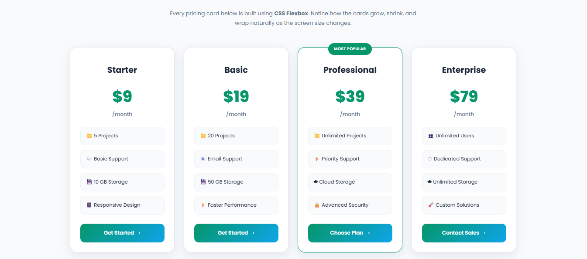
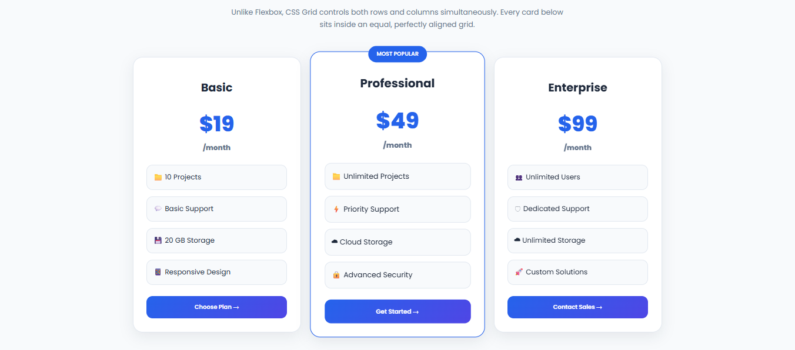

---

# 🔥 Flexbox vs CSS Grid Comparison

| Flexbox | CSS Grid |
|---|---|
| One-dimensional layout | Two-dimensional layout |
| Controls row OR column direction | Controls rows AND columns |
| Best for components | Best for complete sections |
| Items adjust naturally | Layout structure is predefined |
| Uses flex container rules | Uses grid tracks and areas |
| Great for dynamic content | Great for complex interfaces |

---

# 📸 Screenshots

## Flexbox Layout

## CSS Grid Layout

---

# 🎯 Learning Outcomes

Through this project, I practiced:

- Building responsive layouts from scratch
- Understanding CSS layout fundamentals
- Choosing between Flexbox and Grid
- Creating reusable UI patterns
- Improving spacing and alignment
- Writing cleaner CSS
- Creating modern frontend interfaces

---

# 🌐 Live Demo

## 🚀 Live Demo

🔗 **View Project Online:**  
[Flexbox & CSS Grid Playground](https://eisha017.github.io/flexbox-grid-playground/)

---

# 📌 Future Improvements

- Add JavaScript interactions
- Add dark mode support
- Add pricing toggle (monthly/yearly)
- Improve accessibility
- Add more responsive testing

---

# 👩‍💻 Author

**Eisha Naeem**

Computer Engineering Student | Frontend Developer

---

⭐ This project is part of my frontend development learning journey, focusing on mastering modern CSS layouts.